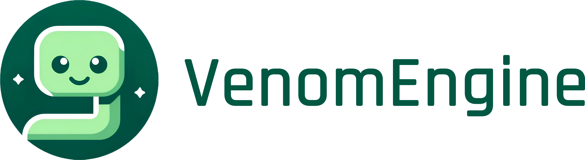

<p align="center">
  
</p>

## 💡 Description

`Venom Engine` is my solo Computer Graphics journey, designed to dive deep into cutting-edge technologies:

- 🧑‍💻️ **Graphics APIs**: Mastering `Vulkan`, `Metal`, and `DirectX12`.
- 🛠️ **Build Systems**: Streamlining development with `Bazel`.
- 🖥️ **Technical Tools**: Exploring `Renderer Debuggers`, `protobuf`, and `HLSL`.
- 💻 **Scripting**: Enhancing workflows with `Ruby` and more.

Join me as I explore these technologies and push the boundaries of what's possible in modern graphics programming.

## ✨ Showcase

TODO

## 🚀 Quick Setup & Compilation

`VenomEngine` uses a combination of `Bazel` & `Makefile` as its build system (will integrate CMake later). 

Here is how to setup and compile the project:

```bash
make dxc
make compile_shaders
make release_run
```

## 🏛️ Features & Roadmap

- [ ] Vulkan Renderer
- [ ] Metal Renderer
- [ ] DirectX12 Renderer
- [x] Bazel Build System
- [ ] CMake Build System
- [x] HLSL to SPIR-V Compilation
- [x] Ruby Task Runner
- [ ] Custom Renderer Debuggers
- [ ] Protobuf Serialization
- [ ] ...

## 📖 Documentation & User Guide

Looking for detailed information? Explore the comprehensive documentation and user guide for `Venom Engine`:

[](https://kevinpruvost.github.io/VenomEngine/html/index.html)